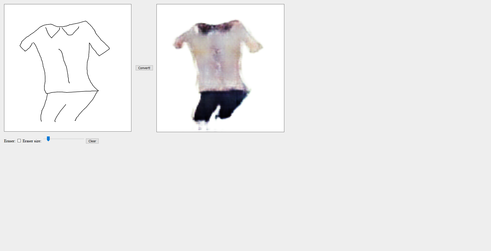
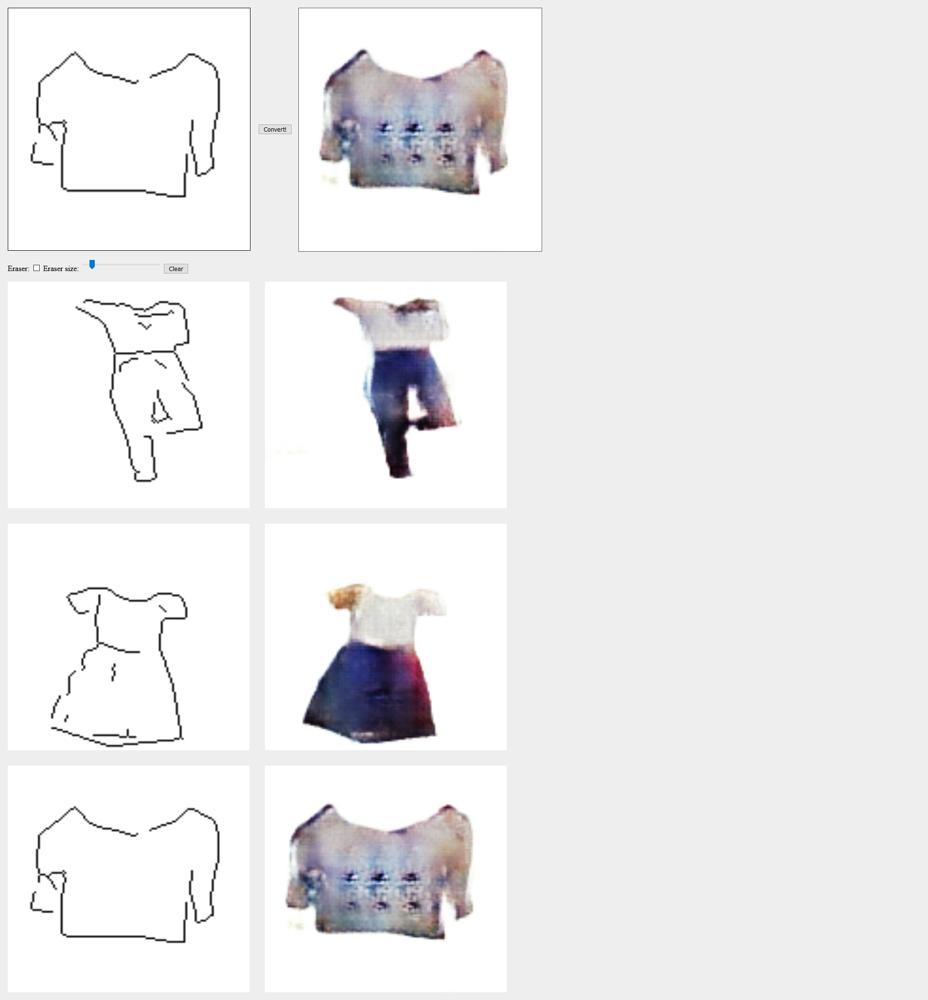

# MID DEMO

The mid demo is a Flask app. 

## Requirements

Tested on Tensorflow 1.4.1, CUDA 8.0 and CuDNN 6.0 

## Set up

To run it, first download the model from [here](https://drive.google.com/open?id=1WIbbx6H6-jlcJwSNdQ_4kiYJtAlBseJd) and paste the contents into the `model` directory.

Then, run these commands:

```
export FLASK_APP=server.py
flask run --port 8000
```

Then go to `localhost:8000` to see the demo.

This is a bare-bones functionality web app to send drawn images to a pix2pix model trained on the DeepFashion2 dataset.

You can also drag and drop multiple 128x128 images onto the canvas and view the results for each.



